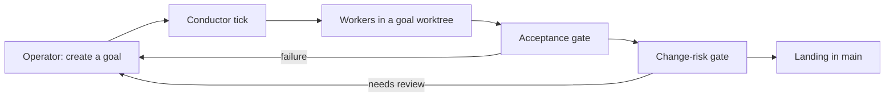

# MCG Agent Orchestrator

This repository runs software development goals through local Codex CLI and Claude CLI workers, verifies their work, and lands accepted changes in `main`. See the [architecture map](docs/architecture.md) for the projects, dependencies, and state ownership.

## Architecture

The [operator runbook](docs/operator-runbook.md#1-golden-path-conductor-first) describes the loop and its policy gates.

## How it works

An operator creates a goal with an objective and acceptance criteria. Automatic intake selects the Scout pipeline: Planner, Developer, Tester, and Reviewer; `--pipeline five-role` also includes a Researcher. The [intake planner](src/Mcg.AgentOrchestrator.App/Orchestration/GoalObjectivePlanner.cs) selects the pipeline, and the [Scout definition](src/Mcg.AgentOrchestrator.App/Cli/CliPersistentStateRunner.Scout.cs) declares its roles.

The conductor creates an isolated git worktree, dispatches the workers, and waits for their results. After review, it runs the acceptance suite against the candidate and applies the change-risk gate. A passing candidate allowed by policy lands in `main`; failures, conflicts, and requests for human input return to the operator. The loop records the landing in SQLite and removes the worktree. Follow the [runbook](docs/operator-runbook.md#1-golden-path-conductor-first) for the complete operating sequence.

## Design decisions

### One authoritative state and one writer

Concurrent writers overwrote the state of an already landed goal and dispatched work onto it again. The [landed-state incident](docs/incidents/2026-07-15-landed-state-races.md) explains the failure; the [state model](docs/state-model.md) separates persisted authority from projections. Recovery commands such as `retry`, `progress`, and `verify-manual` submit typed intents, and the conductor tick applies them as the sole writer of `state.db`, as described in the [runbook](docs/operator-runbook.md#8-operating-discipline-hard-won).

### Attribute failures before landing

Tests merged past as pre-existing red caused later acceptance gates to fail and throttled the board. The [dormant-red incident](docs/incidents/2026-07-15-dormant-reds-gate-monopoly.md) motivates keeping main green; [baseline attribution](docs/baseline-attribution-replay.md) requires executed evidence to distinguish inherited failures from candidate failures.

### Reserve resources for acceptance

Worker self-verification occupied the build slots that acceptance needed, leaving verified goals waiting to land. The [slot-starvation incident](docs/incidents/2026-07-14-acceptance-gate-slot-starvation.md) motivates [acceptance resource isolation and cross-process leases](docs/acceptance-gate-resource-isolation.md).

### Measure the mechanism

Attribution partitions silently ran sequentially because their caller supplied no stable build-slot lease, selecting the verifier's serial fallback. The [cohort attribution case study](docs/case-studies/cohort-attribution-partitions.md) traces that failure and the lease fix. The [test-design discipline](docs/test-design-discipline.md) requires assertions about mechanisms rather than real elapsed time, and the [role capability matrix](docs/role-capability-matrix.md) assigns evidence to roles that can produce it.

## Reading the history

The git log records goal landings as `Integrate goal/<id>`. Worker commits use templated subjects beginning with the task purpose, such as `Implement the scoped slice and keep changes narrow.:`, followed by the worker's first words. `Integrate main into goal/<id> before Developer dispatch` records a branch refresh. Hand-written subjects are operator commits; read the diffs to see the resulting changes.

Goal briefs and orchestrator state live under `.orchestrator/`, which is [ignored by git](.gitignore), so the log does not contain the complete goal context. The earlier operator diary is preserved in [docs/history/handoff-2026-09.md](docs/history/handoff-2026-09.md).

## Status and limits

The system is Windows only, run by a single operator, and dependent on locally installed Codex CLI and Claude CLI workers. It is not packaged for other users. The [CLI reference](docs/cli-reference.md) describes the local setup and worker bridges. The code is published for reading with all rights reserved.

The operator surface is the command line and the event log, described in the [runbook](docs/operator-runbook.md#4-observe-whats-happening). The older browser dashboard is being retired and should not be used.

## Running it

Start with the [operator runbook](docs/operator-runbook.md) for setup, operation, and recovery. The [CLI reference](docs/cli-reference.md) holds the command and setup details. [global.json](global.json) pins the .NET SDK; the sanctioned test command is `scripts/Invoke-TestSummary.ps1 -Target <project>`.

## Projects

The current project inventory is derived from `src/**/*.csproj` (6 production projects) and
`tests/**/*.csproj` (10 test/support projects). See the
[architecture map](docs/architecture.md) for the dependency graph, state ownership, current seams,
and the separately labelled modular-monolith target.

<!-- current-project-inventory:begin -->
| Project | Responsibility | Does not own |
| --- | --- | --- |
| `src/Mcg.AgentOrchestrator.Core/Mcg.AgentOrchestrator.Core.csproj` | Domain model, workflow contracts, and deterministic policy types. | Database persistence, external adapters, or hosting. |
| `src/Mcg.AgentOrchestrator.Infrastructure.Providers/Mcg.AgentOrchestrator.Infrastructure.Providers.csproj` | Concrete model-provider adapters, provider defaults, smoke checks, and agent-catalog persistence. | Host composition or orchestration lifecycle. |
| `src/Mcg.AgentOrchestrator.Infrastructure.OperatorComms/Mcg.AgentOrchestrator.Infrastructure.OperatorComms.csproj` | Operator-channel implementations and message transport behavior. | Goal state, conductor policy, or host composition. |
| `src/Mcg.AgentOrchestrator.Infrastructure/Mcg.AgentOrchestrator.Infrastructure.csproj` | SQLite stores, process and worker execution, worktrees, and acceptance verification. | CLI, dashboard, or executable composition. |
| `src/Mcg.AgentOrchestrator.App/Mcg.AgentOrchestrator.App.csproj` | Headless executable composition root containing the conductor, CLI, maintenance, and application contracts. | ASP.NET hosting and dashboard HTTP endpoints. |
| `src/Mcg.AgentOrchestrator.Dashboard/Mcg.AgentOrchestrator.Dashboard.csproj` | Optional ASP.NET dashboard host that consumes the headless application contracts. | Workflow or maintenance ownership. |
| `tests/Mcg.AgentOrchestrator.Core.Tests/Mcg.AgentOrchestrator.Core.Tests.csproj` | Core policy and repository-documentation contract tests. | Infrastructure or hosted-dashboard integration coverage. |
| `tests/Mcg.AgentOrchestrator.Infrastructure.Tests/Mcg.AgentOrchestrator.Infrastructure.Tests.csproj` | Broad infrastructure, orchestration, worker, workspace, and acceptance tests. | The separately scoped CLI, dashboard, and provider-environment suites. |
| `tests/Mcg.AgentOrchestrator.Infrastructure.Tests/Acceptance/Mcg.AgentOrchestrator.Infrastructure.Acceptance.Tests.csproj` | Focused acceptance execution-owner and invocation-pipeline tests. | Broad infrastructure, CLI, dashboard, or provider-environment coverage. |
| `tests/Mcg.AgentOrchestrator.Dashboard.Tests/Mcg.AgentOrchestrator.Dashboard.Tests.csproj` | Dashboard API and UI behavior tests. | A production Dashboard assembly or general infrastructure coverage. |
| `tests/Mcg.AgentOrchestrator.Infrastructure.Tests/Cli/Mcg.AgentOrchestrator.Infrastructure.Cli.Tests.csproj` | CLI parsing, command, and console-contract tests. | Executable hosting or non-CLI infrastructure coverage. |
| `tests/Mcg.AgentOrchestrator.Infrastructure.Tests/ProviderEnvironment/Mcg.AgentOrchestrator.Infrastructure.ProviderEnvironment.Tests.csproj` | Process-isolated provider environment and configuration tests. | General provider implementation ownership. |
| `tests/Mcg.AgentOrchestrator.TestSupport/Mcg.AgentOrchestrator.TestSupport.csproj` | Shared test fixtures and helpers. | A runnable test suite or production behavior. |
| `tests/Mcg.AgentOrchestrator.Infrastructure.Tests/Fixtures/RealProcessShardProbe/Mcg.AgentOrchestrator.RealProcessShardProbe.csproj` | Executable fixture for real-process shard tests. | Product hosting or general test execution. |
| `tests/Mcg.AgentOrchestrator.Infrastructure.Tests/Fixtures/IsolatedDotnetProbe/Mcg.AgentOrchestrator.IsolatedDotnetProbe.csproj` | Minimal executable fixture for isolated `dotnet` invocation tests. | Product tooling or a standalone test suite. |
| `tests/Mcg.AgentOrchestrator.Infrastructure.Tests/Fixtures/ConsoleIoProbe/Mcg.AgentOrchestrator.ConsoleIoProbe.csproj` | Executable fixture for redirected Console I/O preservation tests. | Product tooling or a standalone test suite. |
<!-- current-project-inventory:end -->

`scripts/OrchestratorSqliteTools/OrchestratorSqliteTools.csproj` and
`tools/Mcg.HiddenLauncher/Mcg.HiddenLauncher.csproj` are outside that `src`/`tests` inventory boundary.
The checkout-local launcher remains `mcg-orchestrator.cmd`; Windows publishing is handled by
`scripts/publish-headless.ps1`. Publish the optional web component separately with
`scripts/publish-dashboard.ps1`; place both outputs in one directory when headless CLI dashboard
commands should launch the component. A headless-only deployment returns an actionable error for
dashboard commands without changing workflow state.
