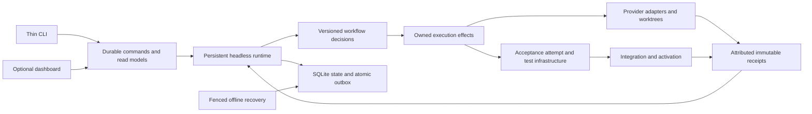

# System architecture audit — 2026-09-06

This replaces the architectural conclusion of [the initial recovery review](architecture-audit-2026-09-06.md). That review was useful incident analysis, but insufficient evidence for a general verdict on the architecture. The user's examples were prompts to broaden the investigation, not an exhaustive checklist.

Priority: **reliability/stability → landing throughput → token efficiency, preserving quality**.

## Judgment

**Inference:** the system has sound ingredients, but its current division of responsibility is not sustainable. It repeatedly implements local safeguards around boundaries that remain ambiguous: who may change workflow state, who owns an execution attempt, what constitutes authoritative completion, and which part of the system owns application operations. These ambiguities increase the amount of code, evidence reconstruction, and operator intervention needed for each new case.

Retain the single-host architecture, SQLite, isolated worktrees, explicit evidence and deterministic acceptance. **Do change the internal architecture deliberately:** establish a persistent headless runtime with a coherent command/state boundary; extract application operations from the dashboard; separate transition decisions from execution effects; move acceptance and process responsibilities into components that actually own their invariants. These changes warrant planned work, not just opportunistic helper extraction after incidents.

Neither replacing SQLite nor introducing distributed services or full event sourcing is justified by the evidence collected. A modular monolith describes a deployment choice, not proof that today's module boundaries are good. The previous review conflated those questions.

## Evidence and limits

**Facts:** source metrics were collected at `9f41e8ccefe7e2c4da42461f0692d3679a8a0d31`; the repository was live and advancing during the audit. Sources included tracked production/test projects, dependency declarations, key execution paths, 1,010 non-merge commits reachable from HEAD since August 7, all 1,287 backlog records' metadata with selected bodies/notes, current read-only SQLite queries, September write telemetry and operation events, prior architecture/compensation/storage/test/velocity studies, and current and historical handoff entries. No credentials were inspected. No production source or running goal was changed to conduct this audit.

An independent Anthropic Opus review examined the system without first reading the narrow recovery assessment. Its disagreements and errors are recorded below; agreement was not substituted for verification.

This is a broad architecture assessment, **not a claim to have read every line, every backlog body, every historical log, or executed every failure path**. Static observations are labeled Fact; causal or design conclusions are Inference; unresolved questions state what would settle them. Current code supersedes stale reports. Historical timings are not presented as current benchmarks. No new test run was needed to measure source topology or inspect stored receipts; the migration proposals still require their own execution evidence.

Reproducible local evidence is under `.orchestrator/operator-evidence/architecture-audit-20260906/`: `system-structure-metrics.json`, `system-history-numstat.txt`, `system-backlog-evidence.json`, `system-operational-metrics.json`, `system-operation-failures.json`, `system-integration-receipt-join.json`, and `opus-system-audit.json`. These operational artifacts are local; the decision-changing results and limitations are reproduced here so this tracked report stands alone.

Collection scripts are retained in that directory's `methods/` subdirectory. Fresh findings were appended to existing backlog owners `16ea5b17` (state/architecture), `877c430d` (responsibility decomposition), `86cac021` (efficiency measurement) and `3b7ffd93` (integration/post-action reconciliation). The last annotation explicitly does not endorse the old item's unproven contention explanation. These annotations preserve the evidence without duplicating umbrella issues or treating this proposal as an implemented migration.

## 1. Actual boundaries and dependency direction

**Fact:** there are five production assemblies. Core is referenced by Infrastructure, Providers and OperatorComms; App references all of them. App uses the Web SDK and contains the CLI, orchestration, dashboard, provider composition and startup. Physical tracked C# lines are approximately:

| Production subtree | Files | Lines |
|---|---:|---:|
| App | 295 | 99,039 |
| Infrastructure | 161 | 77,120 |
| Core | 101 | 29,469 |
| OperatorComms | 27 | 4,884 |
| Providers | 7 | 749 |

App's Orchestration subtree alone is 53,143 lines, CLI 27,977 and Dashboard 14,802. Counts include whitespace/comments and are not complexity scores. Namespace flatness is an intentional repository convention; namespace renaming would not address these findings.

The consequential dependency is behavioral: `ConductorDriver` imports `App.Dashboard.Api` and calls `GoalManagementCommandService.StartSubscriptionReadyTasks` and `StartDispatches` (lines 391 and 469). The same partial service parses dashboard actions and returns dashboard DTOs. CLI paths consume these services too. A presentation-owned component therefore contains application execution behavior.

**Inference:** this is responsibility inversion. Renaming the folder or putting the existing App into another assembly leaves the problem intact. Extract UI-free application command/query contracts first; CLI and dashboard should adapt them. Then make the headless host and optional dashboard separate composition roots and publish artifacts.

**Fact:** `DashboardHost.RunAsync` creates its own web host only when invoked; ordinary conductor execution does **not** start Kestrel. It nevertheless shares App's build/deployment dependency graph. The host also registers `GoalWorktreeOrphanSweepHostedService` (Hosting/DashboardHost.cs:353), placing cleanup lifecycle work in the UI host. The existing OperatorComms extraction is a real assembly cut, but its receipt reports the published bundle grew from 34 to 35 files and retained the dependencies. It did not create a smaller headless product.

**Unknown:** the dashboard's incremental headless startup, RSS and deployment cost has not been isolated. Measure a headless publish/start against the existing host on the same machine before promising savings. The dependency-direction finding does not depend on that measurement. Audit the cleanup service's shared ownership guards before asserting duplicate cleanup races.

**Fact:** Core also performs repository/file I/O in `TestClassDeclarationReader` and `ReverseDependencyTestImpactReader`. **Inference:** Core currently mixes domain policy and repository inspection. Move observation behind an explicit input/adapter boundary where it improves determinism; interface count or a blanket ban on all helper I/O is not a useful migration objective.

## 2. God classes and responsibility growth

**Fact:** file-family metrics and thirty-day change frequency identify a concentrated maintenance surface:

| Component/family | Physical lines | Commits touching main file |
|---|---:|---:|
| GoalAcceptanceVerifier | 9,710 | 102 |
| ConductorDriver family | 8,205 | 117 |
| ConductorBatchLoop family | 5,533 | 64 |
| CliPersistentStateRunner family | 4,924 | 46 |
| AgentOrchestratorKernel family | 7,776 | — |
| CliCommandHandlers family | 10,594 | — |
| WorkerProfileDispatcher | 3,264 | 38 |
| BackgroundDispatchRunner | 3,155 | 66 |

Families include matching collaborators and partial files; these are not AST-derived sizes of single classes. The source census and git-history extraction define the measurement. Driver and Verifier co-changed in 25 commits; Driver and BatchLoop in 25. Association identifies review hotspots, not proof of runtime contention.

The responsibility evidence is stronger than the size evidence. Driver combines admission, task recovery, provider retry budgets, dispatch, focused verification, worktree integration, acceptance and landing. Its numerous injected delegates do not make those decisions independently owned. `AdvanceOnce`'s ordered recovery branches encode precedence; changing one branch can change which other branch is reachable. Whether the code uses `switch` is irrelevant.

Verifier owns attempt setup, build/test invocation, artifact leases, shard scheduling, coverage, completion adjudication, retry/cache interaction and output. The repository has extracted many useful collaborators, yet Verifier and Driver continued growing. Kernel partials and CLI handler partials improve navigation without necessarily reducing shared state or invariants.

`SourceSizeRatchet` itself changed in 38 commits during the history window. Its per-file ceilings and repeated raise justifications have become another shared change surface. **Inference:** the ratchet catches accidental growth, but it cannot certify decomposition. Moving methods into a partial or extracting stateless helpers can satisfy a file-size objective while the same owner retains every decision.

**Recommendation:** decompose around owned concepts, not target line counts:

- Workflow transition policy consumes a current goal/attempt view and returns a typed decision with evidence and precedence. Effect handlers perform dispatch, verification and landing, then submit results against that attempt/version.
- Acceptance attempt owns candidate identity, lifecycle and its evidence set. Build artifacts, test invocation, shard scheduling, verdict/cache policy and integration each own separate contracts. The attempt coordinator composes them without reproducing their internal rules.
- CLI parsing and rendering stop being the place transactions and business operations are selected.

Preserve deterministic gates and existing correct safeguards. Characterize overlapping recovery triggers before changing precedence. An extraction is complete when a collaborator owns an invariant, its caller loses the old responsibility, and its tests can execute independently where appropriate. Measure changed components, dependency reach and verification scope alongside size. Do not freeze emergency reliability fixes behind an absolute no-growth rule.

Owners: `877c430d`, `c9d3f317`, `8aae1018`; the latter already includes user direction that extracted seams need meaningful test isolation.

## 3. State authority and transaction shape

**Fact:** `SqliteOrchestratorStateRepository` already has goal-scoped optimistic concurrency, merge saves and an atomic state/outbox transaction. Those facilities must not be proposed as if absent. The conductor also selectively loads nonterminal, nonparked goals (`CliPersistentStateRunner` around 1464); it does not hydrate all terminal history on every tick.

Critical dispatch checkpoints already set `RejectConflict = true` and abort a stale start (`CliPersistentStateRunner.cs:1215`, `:1231`). Extending conflict rejection is therefore a caller-migration problem, not a missing-primitive problem.

But authority is mixed. `progress`, `retry` and `verify-manual` submit durable operator intents for conductor application. Other CLI mutations and dashboard services write state directly. `SaveGoalSnapshotsWithMergeAsync` reconciles stale snapshots through manually selected field ownership, including task dispatch/retry/process histories. This is a semantic compatibility layer, not merely SQLite concurrency management. Adding a task field can require updating merge semantics correctly in another component.

The generic `TransactWithOutboxAsync` begins a write at line 974, loads the complete kernel at 983, awaits the supplied callback at 990, then writes state/outbox and commits at 1008. Its contract permits arbitrary work while holding the writer. Source: Infrastructure/Persistence/SqliteOrchestratorStateRepository.cs.

**Fact, current observed cost:** the current slow-write log contains 520 receipts since September 1. It emits only holds over 500 ms, so these are **conditional slow-case statistics**, not population latencies:

| Operation | Recorded slow cases | Median hold | p95 hold | Notable observation |
|---|---:|---:|---:|---|
| `cli:task` transaction | 156 | 3.79 s | 8.02 s | All wrote zero rows |
| `cli:answer` transaction | 40 | 6.75 s | 12.22 s | Median 248 rows written |
| `cli:goal` transaction | 31 | 7.54 s | 13.23 s | Median 260 rows written |
| `cli:attention` transaction | 27 | 3.51 s | 10.41 s | All wrote zero rows |

Source: `SqliteWriteTelemetry.cs:163` and the saved operational metrics. Many operations have short acquisition waits compared with their holds. This proves unnecessarily broad application transactions exist; it does not prove a particular failure was caused by contention. Changing database engines would retain this application-level scope problem.

**Inference:** the highest-confidence first slice is to make inspection structurally read-only. `task` only resolves/renders a task and returns false for saving (`CliCommandHandlers.Tasks.cs:325`). Mutation migration is a separate step: the broad transaction's lock currently provides its concurrency protection. Install the affected-goal version check and atomic state/outbox commit before shortening that lock or moving computation outside it. On conflict, recompute against current state; never save an old kernel after dropping its lock. Then retire snapshot reconciliation as ordinary concurrency control, keeping the existing recovery path until each caller has an equivalent safe replacement.

There is a real unresolved policy decision: architecture backlog `16ea5b17` chose multiple SQLite-arbitrated writers in July and deferred a sole-writer daemon, emphasizing offline recovery. Today's inbox guidance moves toward conductor-owned writes. Reconcile this explicitly in the shared architecture/runbook; implementation should not oscillate between the two policies.

Owners: `16ea5b17`, `832b351b`, `1f320d91` (recent park/unpark lost-transition report), `ec331244`.

## 4. Persistent execution, recovery and self-update

**Fact:** current `--daemon` sets idle persistence and watching; it still constructs the same Driver/BatchLoop through the CLI. It is useful operational behavior, not a separate service architecture. Existing `conduct --loop` already has supervision, bounded renewal, an exclusive loop lease, process-start identity checks, wake signals and fallback polling. Successor staging records a source commit and runs a self-check/readiness handshake. Claims that none of this exists are false.

**Fact, this session:** the supervisor survived and renewed the recovered conductor at 02:44 UTC, from PID 9420 to PID 28928, with an immutable staged runtime. This is positive continuity evidence. It does not prove every orphan-worker/acceptance handoff case: active goal `99f7b1f1` addresses that outstanding boundary. The network interruption recovery is documented separately with exact WIP and verification receipts.

**Inference:** make persistent headless execution the supported operational product, rather than continuing to accumulate service behavior around a CLI verb. Its lifecycle contract should expose source commit, runtime generation, lease identity, readiness, last successful reconciliation, pending command age and owned attempts. Reuse the supervisor, staging, job and outbox primitives; this is not a request to discard them or adopt a Windows service installer first.

The service lifecycle and write-authority decisions are separate. A persistent headless runtime is justified without first making it the sole writer. My preferred authority target is for that runtime to apply ordinary workflow commands through short, versioned transitions. CLI/UI submit durable commands and read projections; submitting remains possible when the runtime is down. But queued submission is not offline recovery. Before migrating any additional recovery-capable verb exclusively into the inbox, provide an explicit maintenance applier that fences all ordinary writers and preserves that recovery capability. Controlled ownership transfer and version-compatible schema changes are prerequisites for widening this model.

The viable alternative is multiple writers, each restricted to the same goal-scoped transition protocol with CAS/retry and a complete authority map. That preserves direct offline mutation, but every writer must obey the protocol. **Inference:** runtime ownership fits autonomous operation and the existing inbox, but preference alone is insufficient to authorize universal migration. First inventory every writer and persist merge reasons/changed fields using the existing Merged disposition and merge receipts. Compare the cost of enforcing one transition protocol across them with the cost of ownership transfer and offline recovery. Rare commuting bookkeeping updates favor retaining multiple writers; widespread decision-field interactions strengthen the case for centralized ownership. Neither observation alone proves a winner: disciplined CAS can protect decision fields too, and one owner can still make stale decisions. Record this decision before changing the authority contract. Neither choice requires network RPC or full event sourcing.

Update testing must cover crash before/after durable commit, crash after starting a child but before recording it, old/new runtime overlap, unreadable ownership evidence, pending commands during downtime, and successor rejection. Successful source landing is not the same as activation; activation should be an observable, compatibility-checked step.

## 5. Persistence, evidence and observability

**Fact:** workflow state, run events, intents, backlog, collaboration, acceptance and dogfood records span several SQLite stores and filesystem artifacts. Some paths have duplicated ownership, as the current architecture map itself acknowledges. Separate stores are not inherently a defect: they isolate workloads and retention. State and an outbox delivery intent already commit atomically in `state.db`. That transaction does not atomically commit separate run-event/dogfood stores or external acceptance/TRX artifacts. An intent to publish evidence is not evidence that the effect occurred; the outbox narrows, rather than eliminates, the cross-store reconciliation problem.

**Inference:** the missing architectural contract is end-to-end reconciliation. Distinguish committed transition, scheduled side effect, observed execution result and acknowledged delivery. Each boundary needs a stable identity, idempotent replay and a visible pending/failed disposition. Do not treat an `Applied` transport receipt as proof the requested domain transition occurred. Do not put every event store in one giant database merely to reduce the file count.

**Fact:** the observed state DB was about 822 MB; terminal Completed goals alone held about 426 MB of snapshot JSON. The run-events DB was about 718 MB. Retention, maintenance work caps and terminal-sidecar cleanup already exist; the July storage audit's September correction documents them. A `WorkCapReached` maintenance receipt is bounded progress, not necessarily failure.

Prefer compact current workflow/attempt rows and separately retained immutable evidence over continually embedding history into writable aggregates. First measure read/write amplification and payload growth by goal, then migrate an owner at a time. Preserve evidence needed to justify outcomes and replay recovery.

**Fact:** since September 1, `conductor:dispatch-start` recorded 1,005 Begin events and 999 Failed events. Of the latter, 618 refused Assigned tasks and 371 refused Completed tasks. These **989 refusals are not worker failure statistics**. Their repetition indicates admission/execution disagreement or stale work being retried; the exact path still needs a representative event-to-source trace before a fix is specified.

The accompanying `conductor:dispatch` population includes 828 “Dispatched 1 task(s) but no processes started” events, 359 repetitions across two already-passing-verification refusal messages, and 157 records explicitly showing `prepared=[2f3b53c8:status=Running:admission=none]` alongside “Task status is Completed.” The last message directly establishes inconsistent prepared/start views. These event categories may describe the same logical attempts; do not add them into a worker-failure total. They strengthen the transition/effect-boundary finding, while the causal route and correct repair still require an attempt-linked trace.

**Fact:** 52 first-parent commits with `Integrate goal/<prefix>` since August 23 represented 52 distinct prefixes. Joining those prefixes against all currently stored dogfood records found only four with a record. This is a discrepancy between two inventories, **not 48 proven lost landings or lost database writes**; manual integrations, unfinished post-actions and differing recording semantics need classification. A recent example is `13f5400a`, present in main while its goal still reported Verified. This prevents treating dogfood rows alone as a complete landing denominator.

Recommendation: define one measured outcome chain from candidate through accepted tree, main integration, post-actions and runtime activation. Retain distinctions between apparatus failure, candidate defect, admission refusal, provider interruption and operator hold. Give every blocked goal a current typed reason and next owner; more raw log volume will not accomplish that.

## 6. Verification topology and the landing constraint

**Fact:** tests are **not one assembly**. There are separate Core, Dashboard, Infrastructure, CLI and ProviderEnvironment test projects, plus support/fixture projects. Nested CLI/ProviderEnvironment sources are excluded from the Infrastructure umbrella project. Directory line counts would overstate that assembly's compiled size.

Nevertheless, the umbrella test project still references all production layers and covers many responsibilities. The manifest reconstructs test membership using FQN filters, including a long negative-filter Remainder lane. That lane declares no `exclusiveResourceKeys` (`acceptance-manifest.json:124`); including a newly discovered test in coverage does not establish its resource-isolation requirements. Membership edits collide in shared manifest lines. Current `RepositoryOwnershipMap` has already subdivided production ownership keys by project/subsystem, and some observed test reservations are file-specific; the old claims that all production owns one key or every test reservation is project-wide are obsolete. Remaining reservation granularity must be assessed against the current queue.

**Inference:** decomposition should deliver three independent improvements: narrower production responsibilities, independently runnable tests, and more accurate resource/conflict declarations. A new assembly alone does not prove lower gate time, and a shared resource key cannot safely be deleted merely because files moved. Test membership belongs with the test artifact; the central manifest should retain genuinely central policy/caps/estimates. Preserve invariants proving complete, nonoverlapping coverage and correct shared-resource scheduling.

Historical measurements show that the constraint moved over time: July/August continuity gaps, later serialized acceptance, and September apparatus failures. The August 13 cleanup-hook serial-chain measurements are real historical evidence, **not proof that those hooks are today's dominant floor**. Current goal `a1088fcb` already targets the more recent long lane and serial tail. Remeasure build, queue, longest lane, structural tail, integration and repair time after its landing before increasing concurrency.

**Fact:** current acceptance has partition verdict caching, structural evidence checks and constrained within-attempt retry. A stale comment suggests any red may be rerun; actual policy in `AcceptancePartitionVerdictCache.cs:410` excludes `FailingTrx`, and the completion decision assigns a failing TRX before a generic nonzero exit (`GoalAcceptanceVerifier.cs:7652`). This audit does not substantiate a blanket claim that real test failures are retried to green.

The test estate's own reliability is part of product correctness. Deterministic acceptance of a candidate is only useful when the apparatus reliably executes the intended tests and attributes their results to the right attempt. Prior apparatus percentages and model scorecards identify where to investigate; they do not prove present root causes.

Owners: `caef9efe`, `b5f87dce`, `7b266d28`, `8aae1018`, and the active gate-floor work. Completion needs preserved test discovery/coverage, actual resource-identity evidence, and a matched run demonstrating the claimed isolation or timing benefit.

## 7. Worker/provider contracts, portability and security

**Fact:** `IWorkerProvider`, typed `DispatchOutcome`, process identities, role-based sandbox planning and generated command arguments already exist. Windows owned-process groups and identity-bound checks are valuable safeguards. Existing worker-result parsing and provider-specific branches still span command construction, execution, classification and context packaging. `StaticWorkerProvider.ParseOutcome` shares diagnostic interpretation across providers; the descriptor is not yet a complete executable adapter contract.

**Inference:** provider integration should own launch, structured event decoding, completion and provenance normalization. The shared runtime should receive one immutable attempt completion envelope, preserving provider failure separately from worker verdict and host intervention. Text compatibility parsing should happen at ingress and retain its source; downstream components should not repeatedly reconstruct meaning from combined stdout/source echoes. Evolve the existing contracts rather than adding a parallel framework. Capability descriptions must be verified against actual invocation, not inferred from a model name.

Hermes is valuable as a test of that boundary, not a reason to replace the orchestrator. Its pinned executable identity mismatch is the first scoped goal (`bbf6fe7c`, parent backlog `aa9c7fd6`). Installing it and printing a version is not a model-quality or ACP fit result. After preflight: compare matched tasks against a native harness with equivalent model, tools, constraints and candidate scope; check interruption, cancellation, result attribution, patch quality and human interventions as well as time/tokens. Stop or revise the integration if matching those contracts requires provider-specific branches throughout the core flow.

**Fact:** dashboard hosting supports LAN binding; the inspected endpoint composition uses `EnableOperatorControls` to expose mutations and does not install authentication middleware. Worker sandboxing addresses a different boundary. **Unknown:** the current operator-control exposure and any external network protection were not assessed; this is not evidence of an intrusion or a currently public endpoint.

**Recommendation:** make the trusted-local execution boundary explicit when separating hosts. Remote mutation requires an authenticated authority boundary; read-only hosted views, local operator commands and worker-proposed effects are different capabilities. Test that a read-only role cannot create a state effect and that authority receipts identify the actual origin. Backlog `1895739d` already owns authenticated remote mutation. This audit is not a penetration test.

## 8. Quality, token efficiency and the economics of orchestration

**Fact:** there are explicit criterion/role capability contracts, structured worker guidance, prior-evidence packaging and token-budget controls. Mandatory context can fail closed rather than silently truncate. However, character-based prompt estimates and model context tables are not measured tokenizer counts. Provider-reported input, cached input and output must remain separate; their sum is not subscription quota or dollar cost.

In the 21-goal dogfood recording cohort since August 23, stored histories contained 653 deduplicated dispatches; 266 (40.7%) had all three usage fields Reported. Median dispatches per recorded goal was 24, p95 63. This selected cohort is not all goals; dispatch count is not the historical role-transition “round” metric, and missing usage is not zero usage. No causal savings or model quality ranking follows from these totals.

**Inference:** the strongest efficiency opportunities also improve reliability: avoid impossible criterion assignments, repeated unchanged refusals, rediscovering existing evidence, whole-kernel inspection and broad god-class context. Do those before weakening review or reducing required evidence. The repository's excess-round study explicitly distinguishes useful reviewer-discovered defects from avoidable orchestration loops; preserve that distinction.

The deeper workflow question is whether every small follow-on slice should repeat full research and planning after an epic has already established the design. Backlog `f22bc596` proposes plan-once DAG slices. It deserves a bounded experiment with explicit invalidation: reuse the plan only while assumptions, dependencies and criterion ownership remain valid. Do not silently change today's pipeline policy or treat fewer roles as demonstrated quality preservation.

Measure cost per **accepted, integrated, non-regressed outcome**, including failed/abandoned work and operator time. Add coverage denominators to every efficiency chart. Matched Hermes/native trials, prior-evidence reuse and bounded progressive review are higher-value experiments than unconstrained best-of-N fanout before these denominators are reliable. Relevant owners: `86cac021`, `f22bc596`, `f14098b2`, `813ab477`, `07cd01b2`.

## 9. Architectural governance and migration

**Fact:** many of these concerns were already identified in July/August. The backlog has 681 Open items, while some open umbrella items contain notes describing landed sub-slices. Useful history exists, but status and ownership are not consistently sufficient to decide the next action. Repeated audits that rediscover the same problem without a completion definition are another form of wasted work.

**Inference:** reserve capacity for structural progress along the highest-change paths, and attach each slice to an existing architectural owner. Maintain a small explicit dependency graph; do not intake the stale backlog wholesale. A “helper extracted” receipt must not close an umbrella objective about authority, isolation or operational behavior.

Recommended sequence:

| Order | Deliverable | Feasible evidence owner and stop condition |
|---|---|---|
| 1 | Structurally read-only query path | Developer/Tester prove inspection never acquires a writer; operator measures the same commands with a live loop. Existing mutation concurrency protection stays intact. |
| 2 | One goal-scoped versioned transition and atomic state/outbox path | Developer/Tester prove conflict/replay/rejection before shortening mutation locks; acceptance/operator run crash-boundary checks. Preserve offline recovery. Any expansion of inbox-only recovery verbs requires the fenced maintenance applier in the same slice or earlier. |
| 3 | Acceptance attempt responsibility with its own tests | Independent review checks ownership and existing verdict semantics; acceptance proves equal discovery/coverage. Coordinator loses the responsibility; real isolation/timing claim needs actual runs. |
| 4 | UI-free application service and headless host | Tests prove identical CLI/UI command behavior; operator verifies headless launch/publish and that closing the UI does not alter runtime work. Measure footprint rather than assume it. |
| 5 | Supported persistent lifecycle and an explicit writer-authority decision | Use writer/merge evidence to choose the authority model. Operator-owned restart/crash/upgrade rehearsal proves durable commands, valid ownership, child adoption/fencing and queryable running identity. Offline diagnosis/recovery remains possible. |
| 6 | Evidence reuse and provider-fit experiments | Researcher/Planner define matched cohorts; workers provide artifacts; acceptance/operator own quality and real-harness evidence. Report coverage, interventions and quality, not token totals alone. |

This is an order of incremental delivery, not a requirement to finish all state migration before improving acceptance or starting a host extraction. Reliability fixes continue. Each slice must name the invariant owner and avoid conflicting with live work. Structural briefs need versioned contracts, behavior-preserving baselines and explicit retirement of the old path; otherwise the migration creates yet another parallel mechanism.

Target shape:

These are ownership boundaries; they do not all need separate assemblies, processes or databases. The diagram shows the preferred runtime-owned direction, subject to the explicit writer-authority decision. The versioned transition contract is required under either authority model.

## Independent review reconciliation

The unseeded Opus review independently prioritized split authority, growing Driver/Verifier responsibility, provider completion boundaries and service lifecycle. Its source observations strengthened those findings. I rejected or narrowed several conclusions:

- **“Tests are one assembly”: false.** The current project list and Compile exclusions prove multiple real test assemblies. Remaining umbrella coupling is the actionable issue.
- **Atomicity needs precise scope.** `TransactWithOutboxAsync` commits state and delivery intent together. This does not make external results or separate evidence stores atomic with workflow state; cross-store reconciliation remains load-bearing.
- **“No supervised lifecycle or binary identity”: false as a blanket statement.** Supervisor, readiness, lease, staged source markers and this session's successful renewal exist. The recommendation is to unify and expose the lifecycle, not invent it from zero.
- **“The cleanup-hook floor is the first throughput priority”: not established today.** The cited measurement was August 13. Current gate-floor work and a new phase breakdown should determine the order.
- **“Event sourcing is required by state-model.md”: unsupported.** Versioned transitions and durable effects can satisfy its invariants without full event sourcing.
- **“No provider boundary”: overstated.** An incomplete boundary exists and should be extended, not replaced by a duplicate abstraction.

Review also strengthened a challenge to my first report: the existence of typed outcomes, extracted files and SQLite CAS does not establish that callers preserve those contracts. The audit must follow authority and effects through their consumers.

A second independent review of this report (`opus-system-reconciliation-authorized.json`) led to material revisions: credited existing critical-checkpoint `RejectConflict`; separated safe read-only extraction from mutation concurrency changes; required fenced recovery before expanding inbox-only verbs; distinguished service lifecycle from writer authority; made the Remainder resource-declaration gap explicit; and included prepared/start-state disagreements. I did not accept its proposed binary rule that decision-field conflicts require a single writer, or that rare merges prove multiple writers superior. Those are design tradeoffs requiring protocol and recovery evidence, not conclusions a field-frequency count establishes by itself.

## Unresolved questions that change implementation choices

1. What fraction of present gate wall time is queueing, build, the longest lane, serial tail, repair or integration? Settle with current attempt-linked phase receipts after active gate-floor changes, not an old aggregate.
2. Which direct writers still require snapshot merge, and which fields actually conflict? Add scoped conflict/transition observations; a static field list alone cannot rank migrations by incident frequency.
3. Why do integration and dogfood inventories diverge? Reconcile exact goal/commit/post-action identities and current record semantics. Do not repair records from titles or count alone.
4. What quality/effort benefit does a harness or pipeline change provide? Use matched tasks, explicit missing-data coverage and independent output review; stored provider scores alone cannot answer it.
5. What does dashboard separation save in startup, dependency surface and runtime footprint? Build and measure two equivalent compositions; no numerical benefit has been claimed here.
6. What is the supported recovery and schema compatibility contract between successive runtimes? Rehearse it with old/new fixtures and crash points before making the owner model universal.

These gaps bound the claims; they are not reasons to postpone the structural work already supported by current source and receipts.
